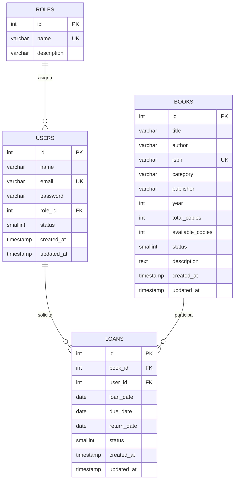

# Modelo relacional y diccionario de datos

## Modelo relacional

## Relaciones

- `roles 1:N users`: cada usuario tiene exactamente un rol.
- `users 1:N loans`: un usuario puede tener varios préstamos.
- `books 1:N loans`: un libro puede aparecer en varios préstamos históricos.
- Las llaves foráneas usan `ON UPDATE CASCADE` y `ON DELETE RESTRICT`.

## Diccionario: roles

| Campo | Tipo | Nulo | Restricción | Descripción |
|---|---|---:|---|---|
| `id` | INTEGER | No | PK, autoincremento | Identificador del rol |
| `name` | VARCHAR(30) | No | Único | `admin`, `librarian` o `reader` |
| `description` | VARCHAR(120) | Sí |  | Nombre descriptivo |
| `created_at` | TIMESTAMP | No |  | Fecha de creación |
| `updated_at` | TIMESTAMP | No |  | Última actualización |

## Diccionario: users

| Campo | Tipo | Nulo | Restricción | Descripción |
|---|---|---:|---|---|
| `id` | INTEGER | No | PK, autoincremento | Identificador del usuario |
| `name` | VARCHAR(100) | No |  | Nombre completo |
| `email` | VARCHAR(150) | No | Único | Correo de acceso normalizado |
| `password` | VARCHAR(100) | No |  | Hash bcrypt; nunca se expone |
| `role_id` | INTEGER | No | FK `roles.id` | Rol asignado |
| `status` | SMALLINT | No | CHECK `0,1` | 0 inactivo, 1 activo |
| `created_at` | TIMESTAMP | No |  | Fecha de creación |
| `updated_at` | TIMESTAMP | No |  | Última actualización |

## Diccionario: books

| Campo | Tipo | Nulo | Restricción | Descripción |
|---|---|---:|---|---|
| `id` | INTEGER | No | PK, autoincremento | Identificador del libro |
| `title` | VARCHAR(180) | No |  | Título |
| `author` | VARCHAR(120) | No |  | Autor |
| `isbn` | VARCHAR(20) | No | Único | Identificador bibliográfico |
| `category` | VARCHAR(80) | No |  | Categoría |
| `publisher` | VARCHAR(120) | Sí |  | Editorial |
| `year` | INTEGER | No | Validado por API | Año de publicación |
| `total_copies` | INTEGER | No | CHECK `>= 1` | Ejemplares registrados |
| `available_copies` | INTEGER | No | CHECK entre 0 y total | Ejemplares disponibles |
| `status` | SMALLINT | No | CHECK `0,1,2` | Inactivo, disponible o no disponible |
| `description` | TEXT | Sí |  | Descripción |
| `created_at` | TIMESTAMP | No |  | Fecha de creación |
| `updated_at` | TIMESTAMP | No |  | Última actualización |

## Diccionario: loans

| Campo | Tipo | Nulo | Restricción | Descripción |
|---|---|---:|---|---|
| `id` | INTEGER | No | PK, autoincremento | Identificador del préstamo |
| `book_id` | INTEGER | No | FK `books.id` | Libro prestado |
| `user_id` | INTEGER | No | FK `users.id` | Usuario responsable |
| `loan_date` | DATE | No |  | Fecha de registro |
| `due_date` | DATE | No | CHECK `>= loan_date` | Fecha límite |
| `return_date` | DATE | Sí | CHECK `>= loan_date` | Fecha real de devolución |
| `status` | SMALLINT | No | CHECK `0,1,2,3` | Cancelado, activo, devuelto o vencido |
| `created_at` | TIMESTAMP | No |  | Fecha de creación |
| `updated_at` | TIMESTAMP | No |  | Última actualización |

## Reglas de integridad

- El correo y el ISBN son únicos.
- Los ejemplares disponibles nunca son negativos ni superan los totales.
- Un préstamo no puede tener fecha límite o devolución anterior al préstamo.
- No existen borrados físicos desde la API para usuarios, libros o préstamos.
- Las operaciones que cambian préstamos e inventario se confirman o revierten juntas.
